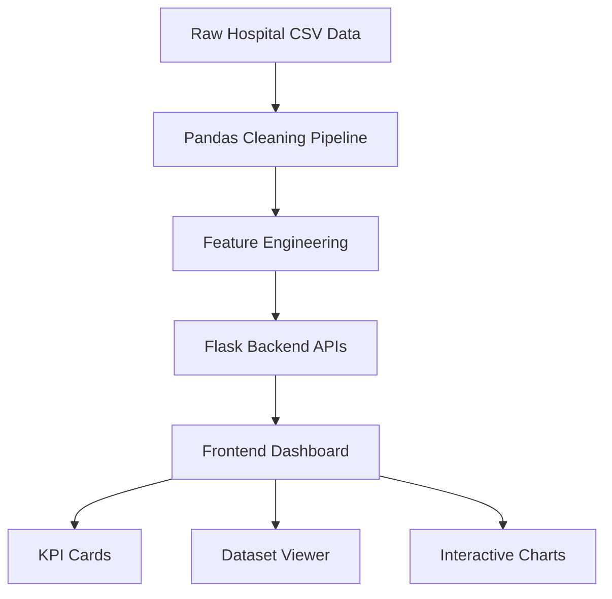

# 🏥 Hospital Capacity & Patient-Flow Planning Dashboard


## 📌 Project Overview

**Hospital Capacity & Patient-Flow Planning Dashboard** is a full-stack healthcare analytics project built to analyze hospital capacity, patient admissions, occupancy pressure, wait times, cancellations, staffing ratios, and regional patient-flow patterns.

Unlike a simple notebook-only project, this project includes a real **Flask backend**, a reusable **Pandas data-cleaning pipeline**, and an interactive **frontend dashboard**. The dashboard fetches raw data, triggers live cleaning, and renders analytics from backend-computed values instead of hardcoded numbers.

This project demonstrates how data analytics can support hospital operations teams in understanding patient load, bed utilization, department-level pressure, and service bottlenecks.

---

## 🎯 Problem Statement

Hospitals need to manage limited resources such as beds, staff, departments, and regional patient inflow. Poor planning can lead to:

* Overcrowded departments
* Long patient wait times
* High cancellation rates
* Inefficient bed utilization
* Poor nurse-to-bed allocation
* Delayed operational decisions

This project uses hospital capacity and patient-flow datasets to clean, analyze, and visualize operational patterns so that hospital teams can make better planning decisions.

---

## 🚀 Key Features

### 🔹 Full-Stack Dashboard

* Flask backend serving both frontend and API routes
* Interactive dashboard built with HTML, CSS, and JavaScript
* Backend APIs used for raw data, cleaned data, KPIs, and charts
* No hardcoded analytics values in the frontend

### 🔹 Real Data-Cleaning Pipeline

* Handles missing values
* Removes duplicate records
* Caps invalid capacity values
* Performs feature engineering
* Reuses the same cleaning logic across notebook, script, and backend

### 🔹 Dataset Viewer

* View raw hospital records
* Trigger real backend cleaning using the **Clean Data** button
* Compare raw and cleaned dataset output

### 🔹 Analytics Dashboard

The dashboard visualizes key hospital operations metrics such as:

* Occupancy by department
* Occupancy by hospital
* Wait-time trends
* Admissions by department
* Admissions by region
* Nurse-to-bed ratio
* Cancellation patterns
* Missing-value counts
* Summary KPI indicators

### 🔹 API-Based Architecture

The frontend communicates with backend APIs:

* `/api/raw/<year>`
* `/api/clean/<year>`
* `/api/summary`
* `/api/charts`

---

## 🧠 What This Project Demonstrates

This project is designed to show practical data analytics and full-stack development skills:

* Data cleaning using Pandas
* Feature engineering for healthcare operations
* Flask API development
* Frontend-backend integration
* Interactive dashboard design
* Reproducible data-science workflow
* Healthcare analytics problem solving
* Deployment-ready project structure

---

## 🛠️ Tech Stack

| Layer                | Tools Used                   |
| -------------------- | ---------------------------- |
| Programming Language | Python                       |
| Backend              | Flask                        |
| Data Processing      | Pandas, NumPy                |
| Frontend             | HTML, CSS, JavaScript        |
| Visualization        | Chart.js / JavaScript Charts |
| Notebook Analysis    | Jupyter Notebook             |
| Deployment Support   | Gunicorn, Procfile           |
| Data Format          | CSV                          |

---

## 📁 Project Structure

```bash
Hospital-Capacity-And-Patient-Flow-Planning/
│
├── Backend/
│   ├── app.py
│   ├── requirements.txt
│   │
│   └── ML/
│       ├── pipeline_lib.py
│       ├── Datacleaning.py
│       ├── Datacleaning.ipynb
│       ├── dataset1_baseline_2025.csv
│       ├── dataset2_comparison_2026.csv
│       ├── charts/
│       └── README.md
│
├── Frontend/
│   └── index.html
│
├── Procfile
└── README.md
```

---

## 🏗️ System Architecture



---

## 📊 Dataset Description

The project uses two hospital datasets:

| Dataset                        | Description                                                 |
| ------------------------------ | ----------------------------------------------------------- |
| `dataset1_baseline_2025.csv`   | Baseline hospital capacity and patient-flow data for 2025   |
| `dataset2_comparison_2026.csv` | Comparison hospital capacity and patient-flow data for 2026 |

The datasets are used to compare hospital operational metrics across years and generate live dashboard analytics.

---

## 🧹 Data Cleaning Pipeline

The cleaning pipeline is implemented in:

```bash
Backend/ML/pipeline_lib.py
```

The same logic is also available in:

```bash
Backend/ML/Datacleaning.py
Backend/ML/Datacleaning.ipynb
```

### Cleaning Steps

The pipeline performs:

* Missing-value detection
* Null-value handling
* Duplicate-record removal
* Invalid capacity correction
* Occupancy-related feature creation
* Cleaned dataset generation
* Summary statistics calculation

This ensures that dashboard charts are based on cleaned and reliable data.

---

## 🔌 API Reference

| Endpoint            | Method | Description                                            |
| ------------------- | ------ | ------------------------------------------------------ |
| `/`                 | GET    | Serves the dashboard frontend                          |
| `/api/raw/<year>`   | GET    | Returns raw CSV records for 2025 or 2026               |
| `/api/clean/<year>` | GET    | Runs the cleaning pipeline and returns cleaned records |
| `/api/summary`      | GET    | Returns dashboard KPI values                           |
| `/api/charts`       | GET    | Returns chart-ready analytics data                     |

---

## ▶️ How to Run Locally

### 1. Clone the Repository

```bash
git clone https://github.com/Prishu-04/Hospital-Capacity-And-Patient-Flow-Planning.git
cd Hospital-Capacity-And-Patient-Flow-Planning
```

### 2. Create a Virtual Environment

```bash
python -m venv venv
```

Activate it:

```bash
# Windows
venv\Scripts\activate
```

```bash
# macOS / Linux
source venv/bin/activate
```

### 3. Install Dependencies

```bash
pip install -r Backend/requirements.txt
```

### 4. Run the Flask App

```bash
python Backend/app.py
```

### 5. Open in Browser

```bash
http://localhost:5000
```

---

## 🚀 Deployment

The project includes a `Procfile`, so it can be deployed on platforms such as Render, Railway, or Heroku-style environments.

```bash
web: gunicorn Backend.app:app
```

To test Gunicorn locally:

```bash
pip install gunicorn
gunicorn Backend.app:app
```

---

## 📈 Dashboard Workflow

When the dashboard loads:

1. The frontend requests summary KPIs from the Flask backend.
2. Raw CSV data can be viewed from the Dataset Viewer tab.
3. Clicking **Clean Data** calls the backend cleaning API.
4. The backend runs the Pandas cleaning pipeline.
5. Cleaned records are returned to the frontend.
6. Analytics charts are generated using backend-computed values.

---

## 📌 Key Insights Generated

This project helps analyze:

* Which departments have the highest occupancy
* Which hospitals face more patient load
* Which regions contribute more admissions
* Where wait times are higher
* How cancellations vary across departments
* Whether nurse-to-bed ratios are balanced
* How missing data affects healthcare analytics

---

## 💡 Business / Healthcare Impact

This dashboard can help hospital operations teams:

* Improve patient-flow planning
* Identify overloaded departments
* Monitor capacity pressure
* Reduce bottlenecks in admissions
* Support staffing decisions
* Track operational inefficiencies
* Make faster data-driven decisions

---

## 🧪 Data Science Deliverables

The project includes both notebook-based and application-based deliverables:

| Deliverable          | Purpose                                             |
| -------------------- | --------------------------------------------------- |
| `Datacleaning.ipynb` | Documented data-cleaning and EDA notebook           |
| `Datacleaning.py`    | Standalone cleaning script                          |
| `pipeline_lib.py`    | Importable cleaning functions used by Flask backend |
| `charts/`            | Static chart outputs from analysis                  |
| Dashboard UI         | Full-stack analytics interface                      |

---

## 🔮 Future Improvements

Planned improvements:

* Add live hospital data integration
* Add machine-learning-based occupancy prediction
* Add department-level risk scoring
* Add downloadable cleaned CSV reports
* Add authentication for admin users
* Add database support using PostgreSQL or SQLite
* Add Docker support
* Add automated testing for APIs
* Deploy live dashboard publicly

---

## ⚠️ Responsible Use Note

This project is created for educational and portfolio purposes. The datasets used here should not be treated as real-time clinical data. In real hospital environments, analytics systems must follow strict privacy, security, validation, and compliance standards before being used for operational or clinical decisions.

---

## 👨‍💻 Author

**Pratyaksh Srivastava**
B.Tech CSE — AI/ML
Aspiring AI/ML Engineer

GitHub: [Prishu-04](https://github.com/Prishu-04)

---

## ⭐ Why This Project Stands Out

This project is more than basic data cleaning. It combines:

* Data analytics
* Backend engineering
* Frontend dashboarding
* Healthcare domain understanding
* Reproducible ML/data workflow
* API-based full-stack architecture

It shows the ability to convert a data-science notebook into a usable real-world dashboard application.
